# TP3-J2EE 
## Simonneau Robin, Pottier Loann, Landry Simon

## **Exercice 1**

## **Exercice 2**
Dans cette exercice, on doit faire une page formulaire qui prend 3 entrée pour a, b et c.  
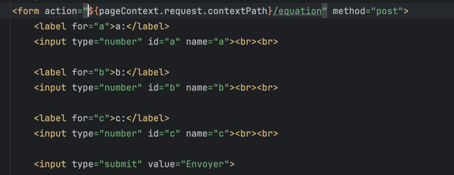  
*Formulaire.jsp*  
Cette page fait appel au Servlet suivant :
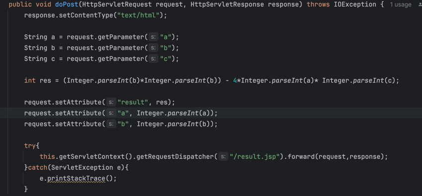  
*Equation.java*

Dans ce servlet, on récupère les 3 paramètre passé via un formulaire POST, on calcul le discriminant, et on renvoie vers une autre page les résultats et variables nécéssaire pour afficher le résultat.
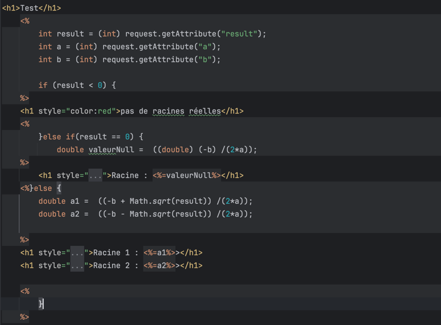  
*result.jsp*

Dans cette JSP, on récupère le résultat de la requête, et celon si il est : supérieur, inférieur ou égale à 0, on effectue le calcul de la racine puis un affichage conditionnel à l'aide de if.
On obtient les résultats suivants :  
   
Avec ∆ < 0  
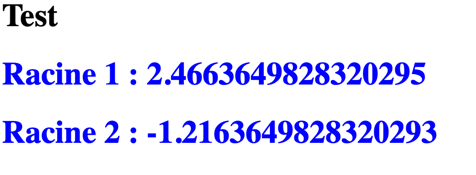   
Avec ∆ > 0  

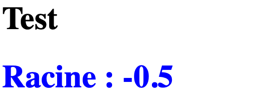   
Avec ∆ = 0  

## **Exercice 3**

Code avec explication

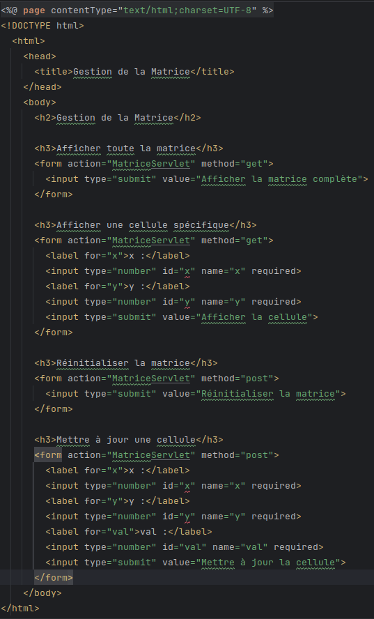

*matrice.jsp*

Un simple fichier jsp qui permet de faire les requetes au servlet

Resultat:

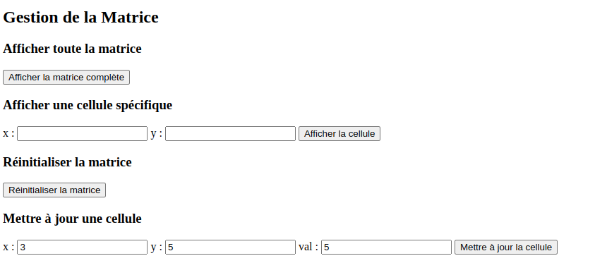

Ici le code pour le servlet:

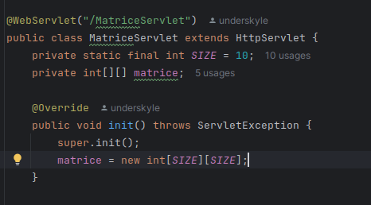

*MatriceServlet.java*

L'initialisation du servlet. La matrice est crée.

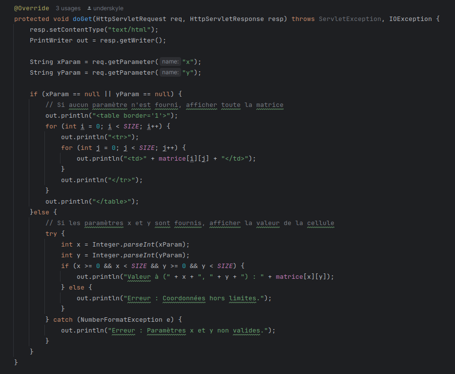

*MatriceServlet.java*

La methode 'get' avec les commentaires explicatifs.

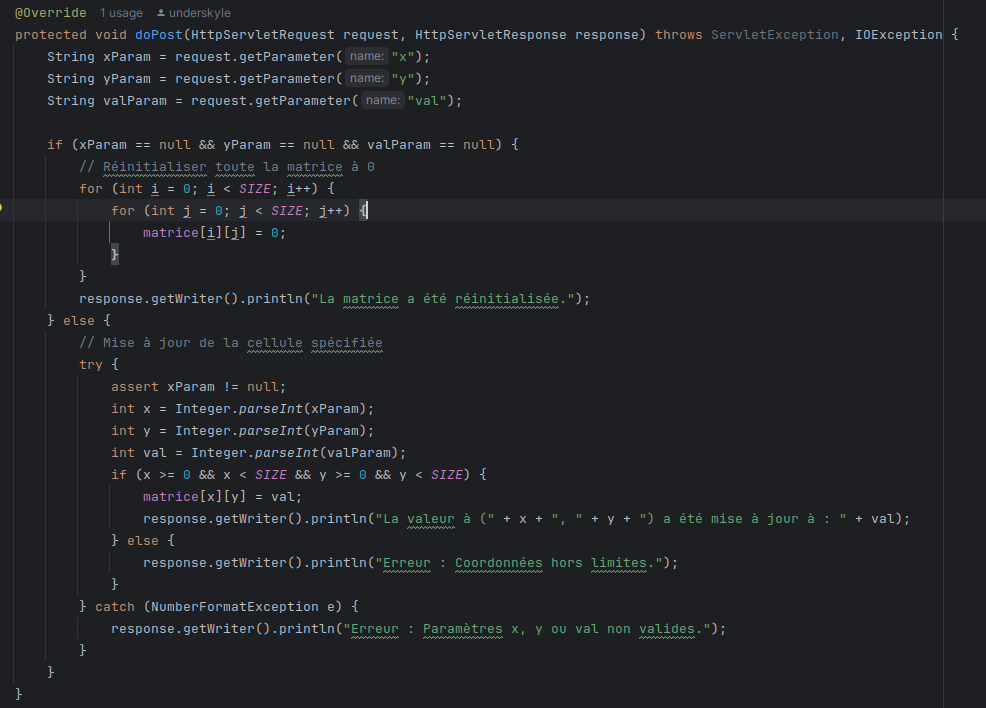

*MatriceServlet.java*

La methode 'post' avec les commentaires explicatifs.

Resultats:

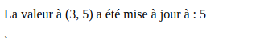

Mise a jour d'une cellule. 

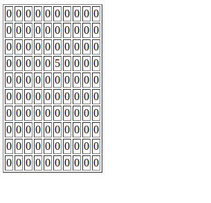

Affichage de la matrice.

