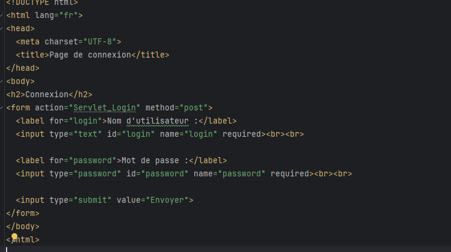
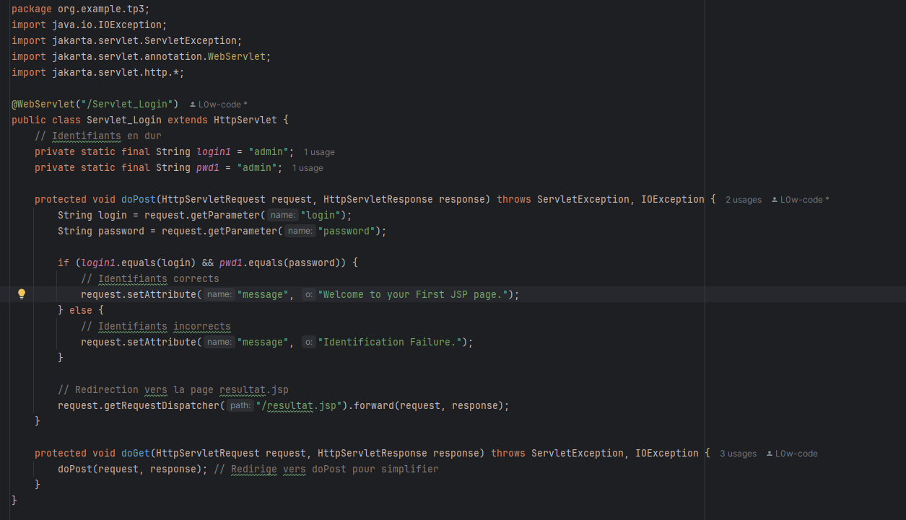
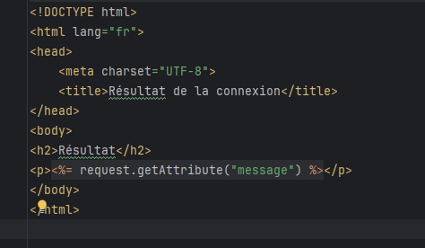
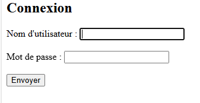
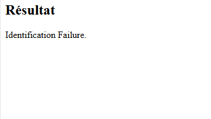
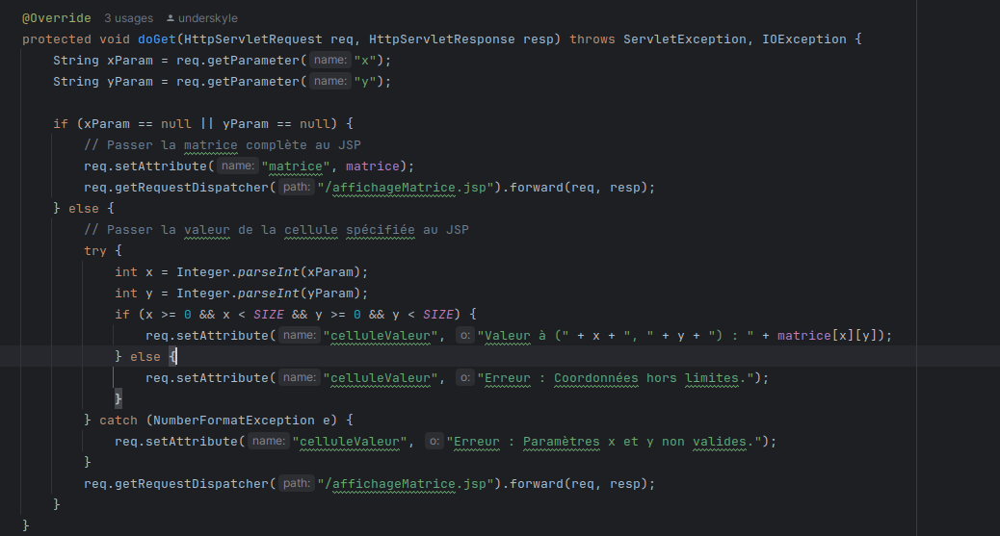
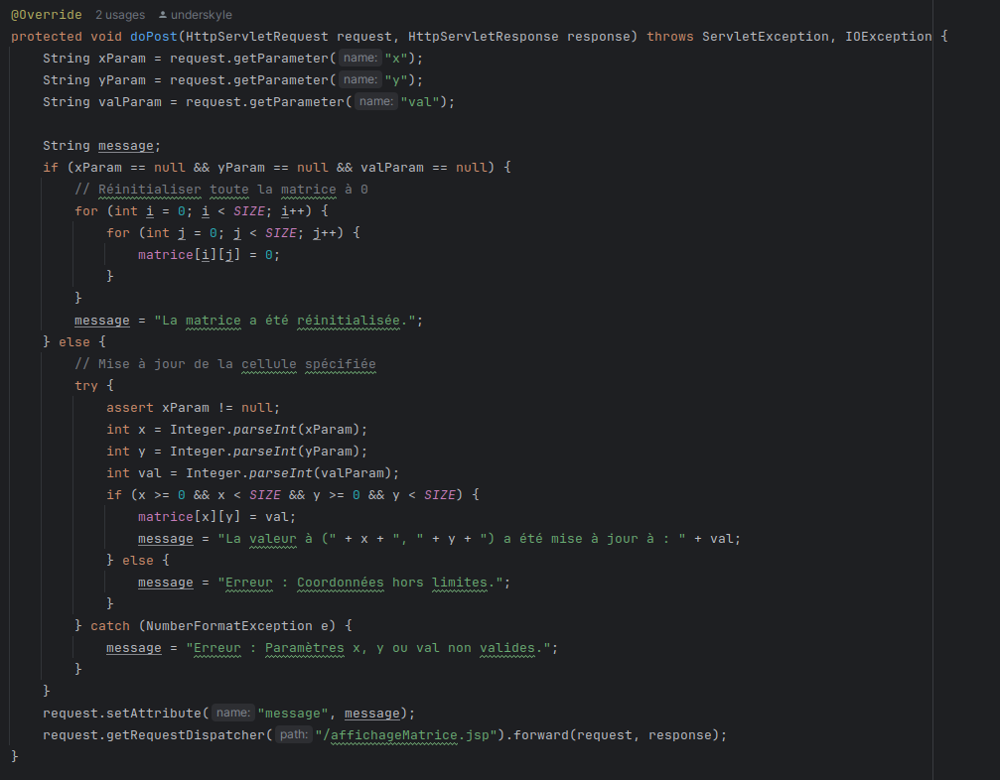
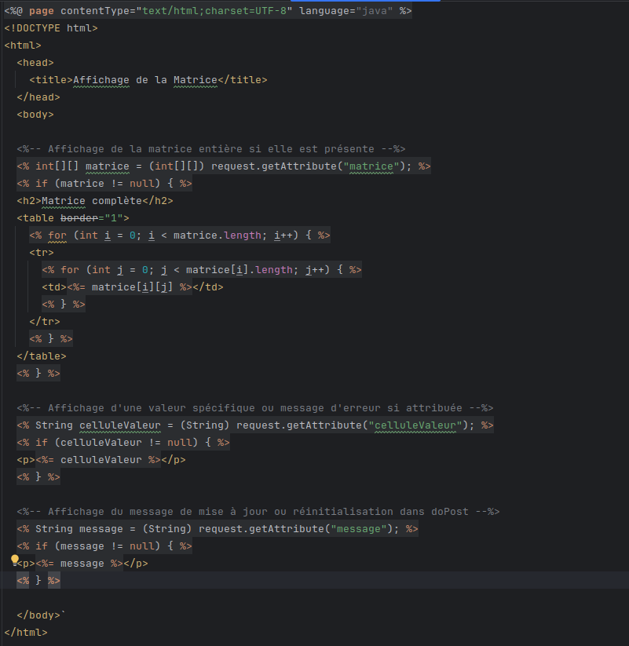
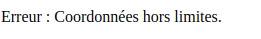

# TP3-J2EE 
## Simonneau Robin, Pottier Loann, Landry Simon

## **Exercice 1**

### ***Code***
  

Dans un premier temps nous avons Login.jsp qui contient un formulaire en méthode “post” qui récupère un login et un mot de passe une fois submit cela va être envoyé et traité par Servlet_Login.java

Une fois le login et mot de passe récupérer nous allons identifier la correspondance si celle-ci est connu et correct alors on renvoie un message sinon on envoie un autre message  qui sont envoyé a une autre page
jsp avec la méthode doGet

Cette dernière page écrit le message envoyé via la méthode doGet en fonction du résultat du traitement 

### *** Resultat *** 

## **Exercice 2**
### ***Code***

Dans cette exercice, on doit faire une page formulaire qui prend 3 entrée pour a, b et c.  
  
*Formulaire.jsp*  
Cette page fait appel au Servlet suivant :
  
*Equation.java*

Dans ce servlet, on récupère les 3 paramètre passé via un formulaire POST, on calcul le discriminant, et on renvoie vers une autre page les résultats et variables nécéssaire pour afficher le résultat.
  
*result.jsp*

Dans cette JSP, on récupère le résultat de la requête, et celon si il est : supérieur, inférieur ou égale à 0, on effectue le calcul de la racine puis un affichage conditionnel à l'aide de if.
### *** Resultat *** 

On obtient les résultats suivants :  
   
Avec ∆ < 0  
   
Avec ∆ > 0  

   
Avec ∆ = 0  

## **Exercice 3**

### ***Code***

*matrice.jsp*

Un simple fichier jsp qui permet de faire les requetes au servlet

Resultat:

Ici le code pour le servlet:

*MatriceServlet.java*

La méthode `init` initialise une matrice 10x10 (`matrice`) remplie de zéros lorsque le servlet démarre, la préparant pour des modifications et des consultations ultérieures.

*MatriceServlet.java*

La méthode `doGet` gère les requêtes GET en transmettant la matrice entière ou une valeur de cellule spécifique à une page JSP (`affichageMatrice.jsp`). Si les paramètres `x` et `y` sont fournis, elle affiche la valeur à la position demandée avec une gestion des erreurs pour les coordonnées hors limites et les paramètres non valides.

*MatriceServlet.java*

La méthode `doPost` gère les requêtes POST pour modifier les valeurs de la matrice. Si aucun paramètre n'est fourni, elle réinitialise toute la matrice à zéro. Sinon, elle met à jour la cellule spécifiée si les coordonnées et la valeur sont valides. Un message de confirmation ou d'erreur est transmis à la page JSP pour affichage.

*affichageMatrice.jsp*

La page JSP `affichageMatrice.jsp` affiche la matrice entière sous forme de tableau si elle est fournie, ou bien la valeur d'une cellule spécifique et des messages d'information ou d'erreur provenant des opérations effectuées dans `doGet` et `doPost` de `MatriceServlet`.

### *** Resultat ***

Mise a jour d'une cellule. 

Affichage de la matrice.

Affichage d'une erreur.

